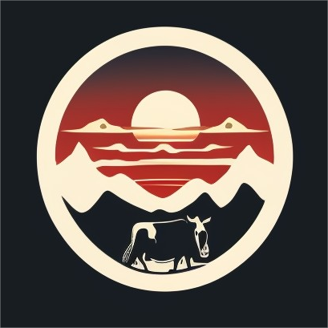
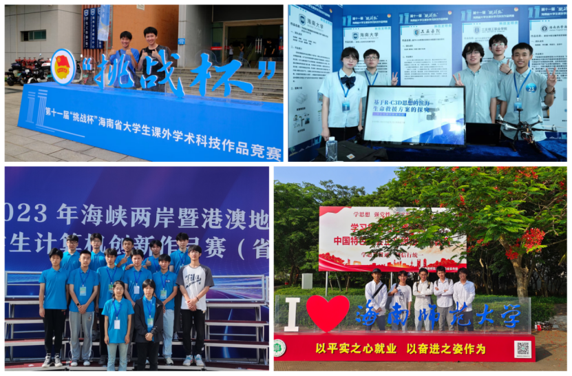
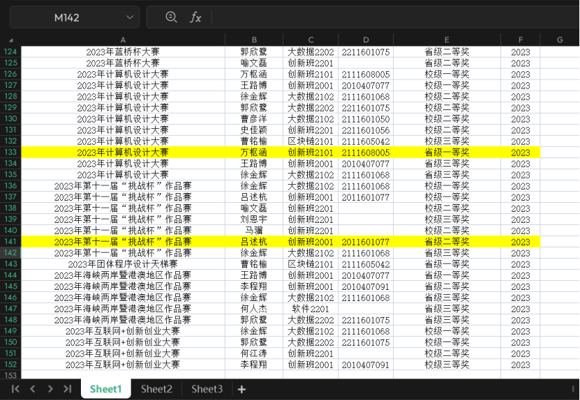
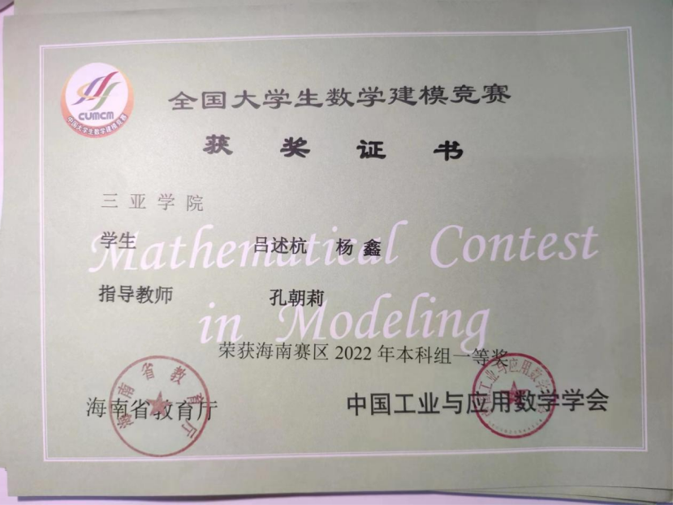
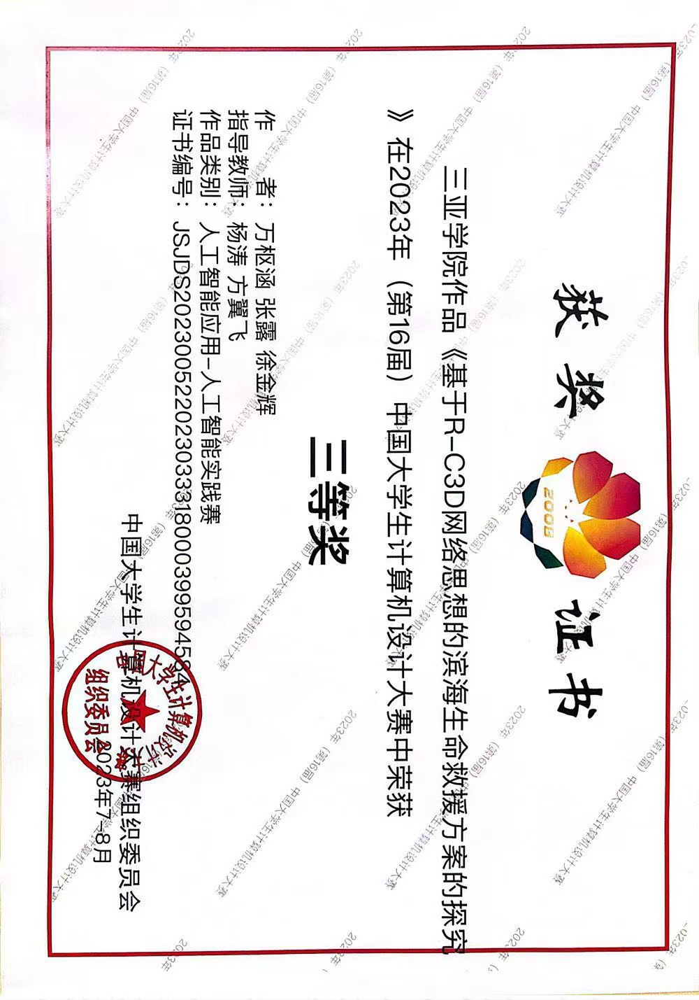
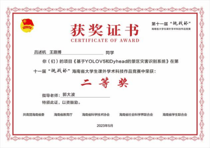
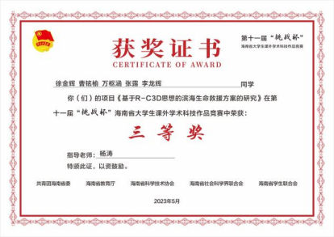
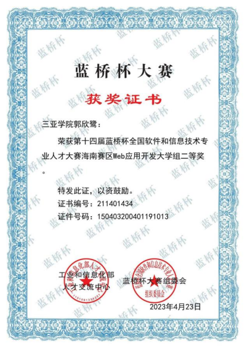
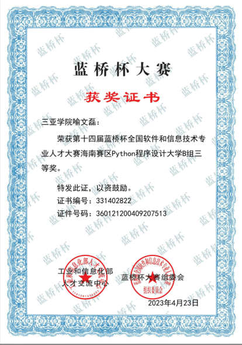
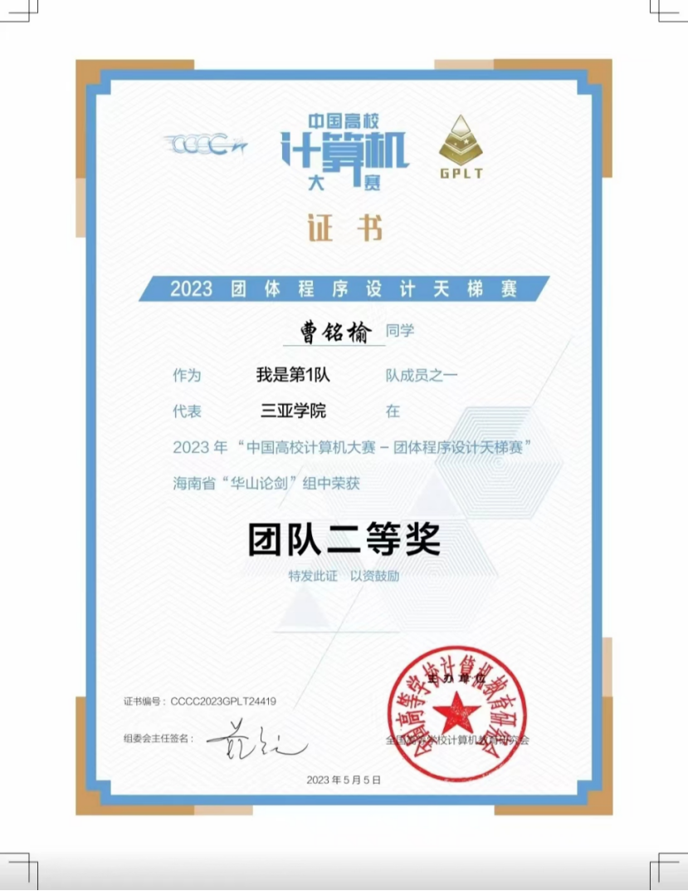

# [GitHub] CodeDriver & Tech Hub

## 🐳牧码南山(Code Driver) 团队🐳

我们是一支独立的，拥有强大活力与高效运作的青年技术团队——牧码南山(Code Driver)！🌏

​

我们来自于中国最南方的大学——三亚学院。自团队建设以来，我们共渡了6个春秋，团队规模也已达到上百人。🤩

我们团结一心，致力于紧跟全球先进技术的发展，积极学习与创新，专注于关键技术的开发与服务。🤗  
我们的组织结构严谨而完善，涵盖软件开发、人工智能、硬件开发、媒体运营等多个部门，充分利用三亚学院的科研与人力资源，实现研发与运营的一体化。🔧  
在校内外，得到众多企业家、教授等专业导师的大力支持，我们坚持严谨、勤奋、求实、创新的理念，恪守着“一万小时定律”。我们深信只有沉淀后的绽放，方能追求卓越，这也是我们实现快速健康发展的秘诀。🌱💪  
与我们一同驰骋技术的世界，探索未知的边界吧！欢迎加入 ==#CodeDriver== 团队，与优秀的小伙伴一起创造无限可能！🤝🦾  
#科技前沿 #学习创新 #青春力量 #牧码南山

​​

‍

### 🏆学科竞赛🏆

学科竞赛，是大学生创新实践能力提升的重要平台，也是锻炼团队合作和创新能力的最佳舞台。近年来，我们信息与智能工程学院在学科竞赛中取得了非凡的成绩，而其中最活跃、最杰出的团队非牧码南山社团莫属！  
自团队创办以来，我们已经度过了六个春秋，不断成长壮大。152枚奖项的辉煌战绩熠熠生辉，其中包括国家级22项，省级81项，校级49项。我们还积极参与了IKCEST第四届“一带一路”国际大数据竞赛暨第八届百度&西安交大大数据竞赛，在全球2867支队伍中荣获第17名的好成绩！🌐🏅  
2023上半学年，我们团队再次获得了29枚耀眼的奖项！更让我们自豪的是，有两支队伍成功跻身国家级大赛，并将在下半学年全力冲刺，我们由衷祝福他们能够收获满满的成绩！🏅

​​

			（2023年4~7月获奖信息汇总）

​

				数学建模大赛[2022]·省赛

​

			      计算机设计大赛[2023]·国赛

​​

 									  挑战杯[2023]·省赛

​​​

									蓝桥杯[2023]·省赛

​

									天梯赛[2023]·省赛

在未来的学科竞赛中，我们定将继续追求卓越，勇攀高峰。牧码南山社团将继续鼓励成员勇于探索，追求创新，为学院争光，为科技发展贡献力量！🌱  
#学科竞赛 #创新实践 #团队荣誉 #牧码南山

‍
